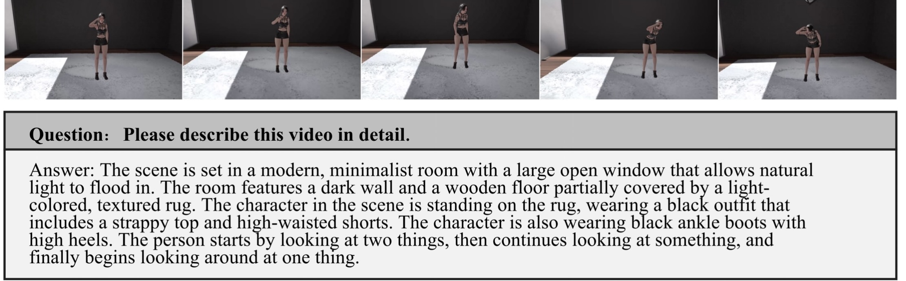

# Motion-caption: Datasets with more detailed action descriptions

---

## 👀 Introduce to Motion-caption

We first process existing datasets to ensure that the captions contain visual information and include more detailed
action descriptions. Additionally, we integrate multi-source data, combining human-labeled action data with virtual 
action data generated using Unity3D. Through effective data fusion and a staged training strategy, we fine-tune existing
large-scale video understanding models to generate captions with richer dynamic information. Experimental results 
demonstrate significant performance improvements across multiple datasets, especially in capturing and generating 
action-related descriptions, with notable advancements compared to the original models. The proposed method offers a new
approach for capturing dynamic information in video understanding models and provides a more practical solution for 
real-world applications.

## Datasets

In this section, we will provide a brief introduction to the construction methods of the four sub-datasets in the Motion Caption 
Dataset.

### Human-labeled Video Caption

The first dataset used in this study consists of 20,000 human-labeled action annotations. This dataset ensures high accuracy 
and richness in the representation of dynamic actions, as the manual labeling captures subtle movements and interactions 
often missed by automated systems. The human-labeled data provides a solid foundation for training models to understand 
and describe complex video actions.

### Video Caption Constructed via Unity3D

The second dataset is composed of simulated data generated using the Unity3D platform. This dataset covers a wide range 
of dynamic scenes and complex actions, which are difficult to obtain in real-world settings due to logistical constraints.
Through simulation, we can create diverse and highly controlled environments that capture both common and rare action 
sequences, enriching the model’s training on dynamic scenes. Specifically, this dataset comprises 8,700 videos, each created
by varying virtual backgrounds, character models, and action sequences. The dataset is paired with accurate caption data, 
ensuring detailed and precise descriptions of the simulated actions

### Video Caption Constructed Based on 2D Videos

The third dataset is specifically designed to capture simple object movements within a constrained setting. Created using 
the MoviePy library, this dataset consists of 2D videos where basic icons move across the screen. To enhance the model’s 
ability to understand elementary object motions, we generated a diverse set of training data by combining various visual 
elements. The dataset includes 20 different background colors, 50 distinct icon types, and 10 different movement patterns, 
resulting in a total of 10,000 unique video-caption pairs. These combinations provide various motion scenarios, allowing 
the model to recognize and track basic movements in simplified environments effectively. The diversity in background, icon 
types, and movement styles makes this dataset an essential component in training the model to handle fundamental object 
motions and interactions.

### Video Caption Constructed through an Automated Pipeline

For the 2D and Unity3D videos, because the scenes, characters, and movements are constrained and lack generalization, we 
developed an algorithm capable of broadly processing videos from all 3 types of environments. This algorithm extracts 
motion information from the videos and incorporates it into the original captions. This approach not only ensures that 
the video data becomes more generalized but also minimizes alterations to the original captions, maintaining their core 
structure. Through this method, we processed a total of 100k videos, generating 5k videos with enriched motion information 
integrated into their captions. This represents the most significant enhancement in our dataset, ensuring both 
comprehensiveness and accuracy in describing video dynamics.

## Dataset Construction Process:

The original dataset utilizes data from CogVideoX, with each video accompanied by captions generated by CogVideoX. First,
the captions are processed using GPT- 4o to extract the names of the main objects in the video descriptions. These extracted
keywords are then used in YOLO-World to perform open-world vocabulary detection on a single frame of the video, identifying 
the bounding box coordinates of objects within that frame. Next, SAM2 is employed to segment and label the objects in the 
frame. The identified objects are then tracked and segmented across subsequent frames. SAM2 provides the masks for the 
objects in each frame, and an algorithm is applied to calculate the motion information of the objects. Simultaneously, 
co-tracker is used to analyze the camera movement, filtering out motion caused solely by camera movement, and ensuring 
that only the absolute movement of objects is retained. Finally, the summarized motion information is integrated into the 
original captions using GPT-4o. The The above method’s code is provided in [code](https://github.com/motion-caption/motion-caption.github.io/tree/main/code).
